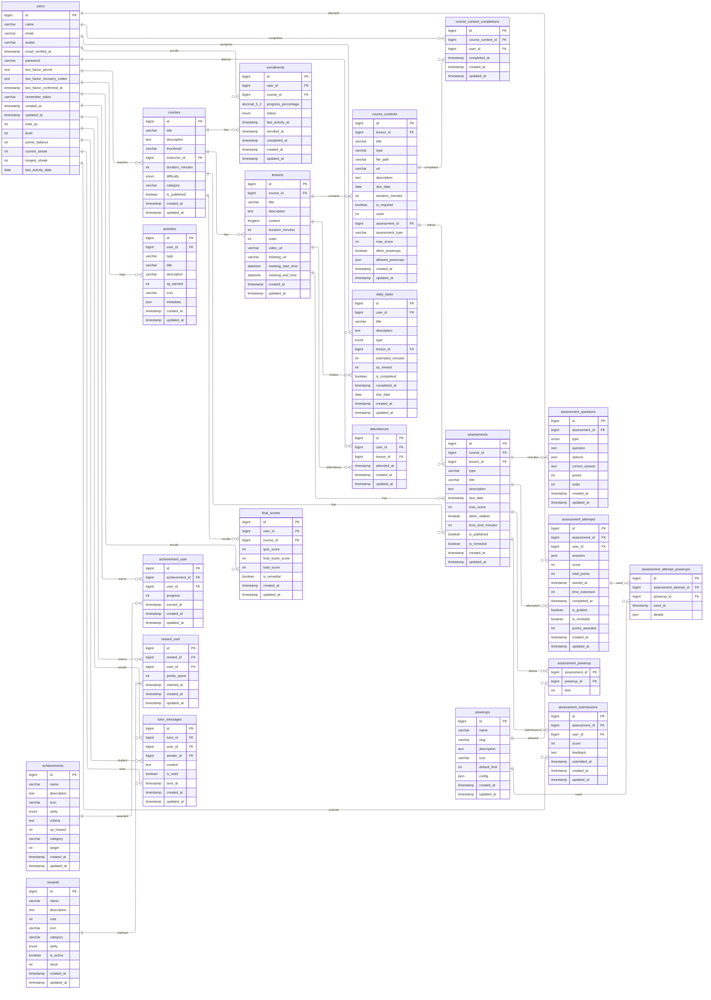

# Database Guide

## Scope

This guide documents the application tables in the current database and their relationships. It excludes Laravel default tables (except `users`) and Spatie permission tables.

Excluded Laravel default tables: `cache`, `cache_locks`, `failed_jobs`, `job_batches`, `jobs`, `migrations`, `password_reset_tokens`, `sessions`
Excluded Spatie permission tables: `roles`, `permissions`, `model_has_roles`, `model_has_permissions`, `role_has_permissions`

## ERD

## Tables

### `users`

Purpose: Core user accounts with gamification fields (XP, level, points, streaks).

Primary key: `id`

Columns:

- `id` (bigint unsigned, not null)
- `name` (varchar(255), not null)
- `email` (varchar(255), not null)
- `avatar` (varchar(255), null)
- `email_verified_at` (timestamp, null)
- `password` (varchar(255), not null)
- `two_factor_secret` (text, null)
- `two_factor_recovery_codes` (text, null)
- `two_factor_confirmed_at` (timestamp, null)
- `remember_token` (varchar(100), null)
- `created_at` (timestamp, null)
- `updated_at` (timestamp, null)
- `total_xp` (int, not null)
- `level` (int, not null)
- `points_balance` (int, not null)
- `current_streak` (int, not null)
- `longest_streak` (int, not null)
- `last_activity_date` (date, null)

Relationships:

- One user can instruct many `courses` via `courses.instructor_id`.
- One user can have many `enrollments`, `assessment_attempts`, `assessment_submissions`, `activities`, `achievement_user`, `daily_tasks`, `attendances`, `final_scores`, `reward_user`, `course_content_completions`, and `tutor_messages`.
- `tutor_messages.sender_id` is nullable to allow sender removal while keeping the message.

### `courses`

Purpose: Course catalog with instructor ownership and publish status.

Primary key: `id`

Columns:

- `id` (bigint unsigned, not null)
- `title` (varchar(255), not null)
- `description` (text, not null)
- `thumbnail` (varchar(255), null)
- `instructor_id` (bigint unsigned, not null)
- `duration_minutes` (int, null)
- `difficulty` (enum('beginner','intermediate','advanced'), not null)
- `category` (varchar(255), null)
- `is_published` (tinyint(1), not null)
- `created_at` (timestamp, null)
- `updated_at` (timestamp, null)

Relationships:

- Belongs to `users` via `instructor_id`.
- Has many `lessons`, `assessments`, `enrollments`, and `final_scores`.

### `lessons`

Purpose: Lessons within a course, including content and optional meeting metadata.

Primary key: `id`

Columns:

- `id` (bigint unsigned, not null)
- `course_id` (bigint unsigned, not null)
- `title` (varchar(255), not null)
- `description` (text, null)
- `content` (longtext, null)
- `duration_minutes` (int, not null)
- `order` (int, not null)
- `video_url` (varchar(255), null)
- `meeting_url` (varchar(255), null)
- `meeting_start_time` (datetime, null)
- `meeting_end_time` (datetime, null)
- `created_at` (timestamp, null)
- `updated_at` (timestamp, null)

Relationships:

- Belongs to `courses`.
- Has many `course_contents`, `assessments`, `attendances`, and `daily_tasks`.

### `course_contents`

Purpose: Individual content items inside a lesson (files, links, videos, or assessments). When type is 'assessment', it links to an assessment record and includes assessment-specific configuration.

Primary key: `id`

Columns:

- `id` (bigint unsigned, not null)
- `lesson_id` (bigint unsigned, not null)
- `title` (varchar(255), not null)
- `type` (varchar(255), not null) - Values: 'file', 'video', 'link', 'assessment', 'attendance'
- `file_path` (varchar(255), null)
- `url` (varchar(255), null)
- `description` (text, null)
- `due_date` (date, null)
- `duration_minutes` (int, null)
- `is_required` (tinyint(1), not null)
- `order` (int, not null)
- `assessment_id` (bigint unsigned, null) - Foreign key to assessments table, populated when type is 'assessment'
- `assessment_type` (varchar(255), null) - Values: 'practice', 'quiz', 'final_exam' (used when type is 'assessment')
- `max_score` (int, null) - Maximum score for the assessment (used when type is 'assessment')
- `allow_powerups` (tinyint(1), not null, default: 1) - Whether powerups are allowed for this assessment
- `allowed_powerups` (json, null) - Array of powerup configurations: [{id: number, limit: number}, ...]
- `created_at` (timestamp, null)
- `updated_at` (timestamp, null)

Relationships:

- Belongs to `lessons`.
- Optionally belongs to `assessments` via `assessment_id` (when type is 'assessment').
- Has many `course_content_completions`.

Notes:

- When `type` is 'assessment', an assessment record is automatically created/synced.
- `assessment_type` must be one of: 'practice', 'quiz', or 'final_exam'.
- `allowed_powerups` is a JSON array storing powerup IDs and their usage limits.
- For 'final_exam' assessment type, `allow_powerups` is automatically set to false and `allowed_powerups` is cleared.

### `course_content_completions`

Purpose: Tracks which users completed specific lesson content items.

Primary key: `id`

Columns:

- `id` (bigint unsigned, not null)
- `course_content_id` (bigint unsigned, not null)
- `user_id` (bigint unsigned, not null)
- `completed_at` (timestamp, null)
- `created_at` (timestamp, null)
- `updated_at` (timestamp, null)

Relationships:

- Belongs to `course_contents`.
- Belongs to `users`.

### `enrollments`

Purpose: User enrollment records for courses with progress and status.

Primary key: `id`

Columns:

- `id` (bigint unsigned, not null)
- `user_id` (bigint unsigned, not null)
- `course_id` (bigint unsigned, not null)
- `progress_percentage` (decimal(5,2), not null)
- `status` (enum('active','completed','paused'), not null)
- `last_activity_at` (timestamp, null)
- `enrolled_at` (timestamp, not null)
- `completed_at` (timestamp, null)
- `created_at` (timestamp, null)
- `updated_at` (timestamp, null)

Relationships:

- Belongs to `users`.
- Belongs to `courses`.

### `assessments`

Purpose: Quizzes/exams attached to a course or optionally a specific lesson.

Primary key: `id`

Columns:

- `id` (bigint unsigned, not null)
- `course_id` (bigint unsigned, not null)
- `lesson_id` (bigint unsigned, null)
- `type` (varchar(255), not null)
- `title` (varchar(255), not null)
- `description` (text, null)
- `due_date` (timestamp, null)
- `max_score` (int, not null)
- `allow_retakes` (tinyint(1), not null)
- `time_limit_minutes` (int, null)
- `is_published` (tinyint(1), not null)
- `is_remedial` (tinyint(1), not null)
- `created_at` (timestamp, null)
- `updated_at` (timestamp, null)

Relationships:

- Belongs to `courses`.
- Optionally belongs to `lessons`.
- Has many `assessment_questions`, `assessment_attempts`, and `assessment_submissions`.
- Uses `powerups` via `assessment_powerup`.

### `assessment_questions`

Purpose: Questions that make up an assessment.

Primary key: `id`

Columns:

- `id` (bigint unsigned, not null)
- `assessment_id` (bigint unsigned, not null)
- `type` (enum('multiple_choice','fill_blank','essay'), not null)
- `question` (text, not null)
- `options` (json, null)
- `correct_answer` (text, null)
- `points` (int, not null)
- `order` (int, not null)
- `created_at` (timestamp, null)
- `updated_at` (timestamp, null)

Relationships:

- Belongs to `assessments`.

### `assessment_attempts`

Purpose: Stores each user attempt for an assessment, including answers and grading status.

Primary key: `id`

Columns:

- `id` (bigint unsigned, not null)
- `assessment_id` (bigint unsigned, not null)
- `user_id` (bigint unsigned, not null)
- `answers` (json, null)
- `score` (int, null)
- `total_points` (int, not null)
- `started_at` (timestamp, null)
- `time_extension` (int, not null)
- `completed_at` (timestamp, null)
- `is_graded` (tinyint(1), not null)
- `is_remedial` (tinyint(1), not null)
- `points_awarded` (int, not null)
- `created_at` (timestamp, null)
- `updated_at` (timestamp, null)

Relationships:

- Belongs to `assessments`.
- Belongs to `users`.
- Has many `assessment_attempt_powerups`.

### `assessment_attempt_powerups`

Purpose: Tracks powerups used during specific assessment attempts.

Primary key: `id`

Columns:

- `id` (bigint unsigned, not null)
- `assessment_attempt_id` (bigint unsigned, not null)
- `powerup_id` (bigint unsigned, not null)
- `used_at` (timestamp, not null)
- `details` (json, null)

Relationships:

- Belongs to `assessment_attempts`.
- Belongs to `powerups`.

### `assessment_powerup`

Purpose: Pivot table defining which powerups are allowed for each assessment.

Primary key: `assessment_id`, `powerup_id`

Columns:

- `assessment_id` (bigint unsigned, not null)
- `powerup_id` (bigint unsigned, not null)
- `limit` (int unsigned, not null)

Relationships:

- Belongs to `assessments`.
- Belongs to `powerups`.

### `assessment_submissions`

Purpose: Submission records for assessments (commonly used for manual grading or feedback).

Primary key: `id`

Columns:

- `id` (bigint unsigned, not null)
- `assessment_id` (bigint unsigned, not null)
- `user_id` (bigint unsigned, not null)
- `score` (int, null)
- `feedback` (text, null)
- `submitted_at` (timestamp, null)
- `created_at` (timestamp, null)
- `updated_at` (timestamp, null)

Relationships:

- Belongs to `assessments`.
- Belongs to `users`.

### `attendances`

Purpose: Attendance records for lessons.

Primary key: `id`

Columns:

- `id` (bigint unsigned, not null)
- `user_id` (bigint unsigned, not null)
- `lesson_id` (bigint unsigned, not null)
- `attended_at` (timestamp, not null)
- `created_at` (timestamp, null)
- `updated_at` (timestamp, null)

Relationships:

- Belongs to `users`.
- Belongs to `lessons`.

### `daily_tasks`

Purpose: Per-user tasks used for daily activity tracking and XP rewards.

Primary key: `id`

Columns:

- `id` (bigint unsigned, not null)
- `user_id` (bigint unsigned, not null)
- `title` (varchar(255), not null)
- `description` (text, null)
- `type` (enum('lesson','quiz','practice','reading'), not null)
- `lesson_id` (bigint unsigned, null)
- `estimated_minutes` (int, not null)
- `xp_reward` (int, not null)
- `is_completed` (tinyint(1), not null)
- `completed_at` (timestamp, null)
- `due_date` (date, not null)
- `created_at` (timestamp, null)
- `updated_at` (timestamp, null)

Relationships:

- Belongs to `users`.
- Optionally belongs to `lessons`.

### `final_scores`

Purpose: Final score summary for a user in a course.

Primary key: `id`

Columns:

- `id` (bigint unsigned, not null)
- `user_id` (bigint unsigned, not null)
- `course_id` (bigint unsigned, not null)
- `quiz_score` (int, not null)
- `final_exam_score` (int, not null)
- `total_score` (int, not null)
- `is_remedial` (tinyint(1), not null)
- `created_at` (timestamp, null)
- `updated_at` (timestamp, null)

Relationships:

- Belongs to `users`.
- Belongs to `courses`.

### `activities`

Purpose: Activity feed entries for user actions and XP gains.

Primary key: `id`

Columns:

- `id` (bigint unsigned, not null)
- `user_id` (bigint unsigned, not null)
- `type` (varchar(255), not null)
- `title` (varchar(255), null)
- `description` (varchar(255), not null)
- `xp_earned` (int, not null)
- `icon` (varchar(255), null)
- `metadata` (json, null)
- `created_at` (timestamp, null)
- `updated_at` (timestamp, null)

Relationships:

- Belongs to `users`.

### `achievements`

Purpose: Achievement definitions and rewards.

Primary key: `id`

Columns:

- `id` (bigint unsigned, not null)
- `name` (varchar(255), not null)
- `description` (text, not null)
- `icon` (varchar(255), not null)
- `rarity` (enum('bronze','silver','gold','platinum'), not null)
- `criteria` (text, null)
- `xp_reward` (int, not null)
- `category` (varchar(255), not null)
- `target` (int, not null)
- `created_at` (timestamp, null)
- `updated_at` (timestamp, null)

Relationships:

- Linked to `users` through `achievement_user`.

### `achievement_user`

Purpose: Tracks user progress and awards for achievements.

Primary key: `id`

Columns:

- `id` (bigint unsigned, not null)
- `achievement_id` (bigint unsigned, not null)
- `user_id` (bigint unsigned, not null)
- `progress` (int, not null)
- `earned_at` (timestamp, null)
- `created_at` (timestamp, null)
- `updated_at` (timestamp, null)

Relationships:

- Belongs to `achievements`.
- Belongs to `users`.

### `powerups`

Purpose: Powerup definitions used in assessments.

Primary key: `id`

Columns:

- `id` (bigint unsigned, not null)
- `name` (varchar(255), not null)
- `slug` (varchar(255), not null)
- `description` (text, null)
- `icon` (varchar(255), null)
- `default_limit` (int unsigned, not null)
- `config` (json, null)
- `created_at` (timestamp, null)
- `updated_at` (timestamp, null)

Relationships:

- Linked to `assessments` through `assessment_powerup`.
- Linked to `assessment_attempts` through `assessment_attempt_powerups`.

### `rewards`

Purpose: Reward catalog items that users can redeem with points.

Primary key: `id`

Columns:

- `id` (bigint unsigned, not null)
- `name` (varchar(255), not null)
- `description` (text, not null)
- `cost` (int, not null)
- `icon` (varchar(255), not null)
- `category` (varchar(255), null)
- `rarity` (enum('common','rare','epic','legendary'), not null)
- `is_active` (tinyint(1), not null)
- `stock` (int, null)
- `created_at` (timestamp, null)
- `updated_at` (timestamp, null)

Relationships:

- Linked to `users` through `reward_user`.

### `reward_user`

Purpose: Records reward redemptions by users.

Primary key: `id`

Columns:

- `id` (bigint unsigned, not null)
- `reward_id` (bigint unsigned, not null)
- `user_id` (bigint unsigned, not null)
- `points_spent` (int, not null)
- `claimed_at` (timestamp, not null)
- `created_at` (timestamp, null)
- `updated_at` (timestamp, null)

Relationships:

- Belongs to `rewards`.
- Belongs to `users`.

### `tutor_messages`

Purpose: Messages exchanged between tutors and users.

Primary key: `id`

Columns:

- `id` (bigint unsigned, not null)
- `tutor_id` (bigint unsigned, not null)
- `user_id` (bigint unsigned, not null)
- `sender_id` (bigint unsigned, null)
- `content` (text, not null)
- `is_read` (tinyint(1), not null)
- `sent_at` (timestamp, not null)
- `created_at` (timestamp, null)
- `updated_at` (timestamp, null)

Relationships:

- Belongs to `users` via `tutor_id` (tutor), `user_id` (student), and `sender_id` (message author).
